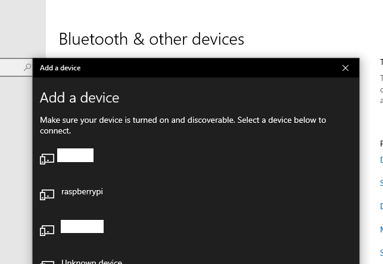
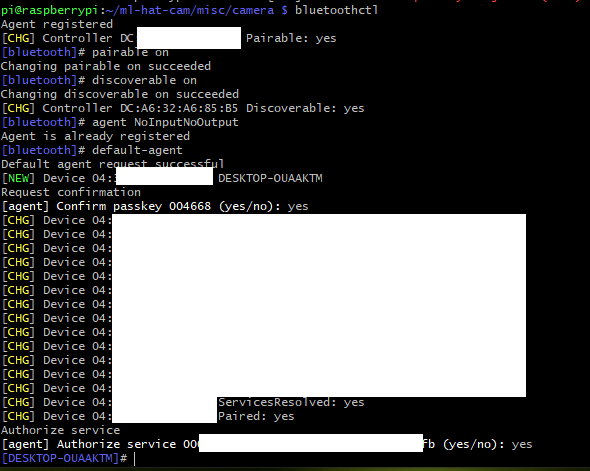
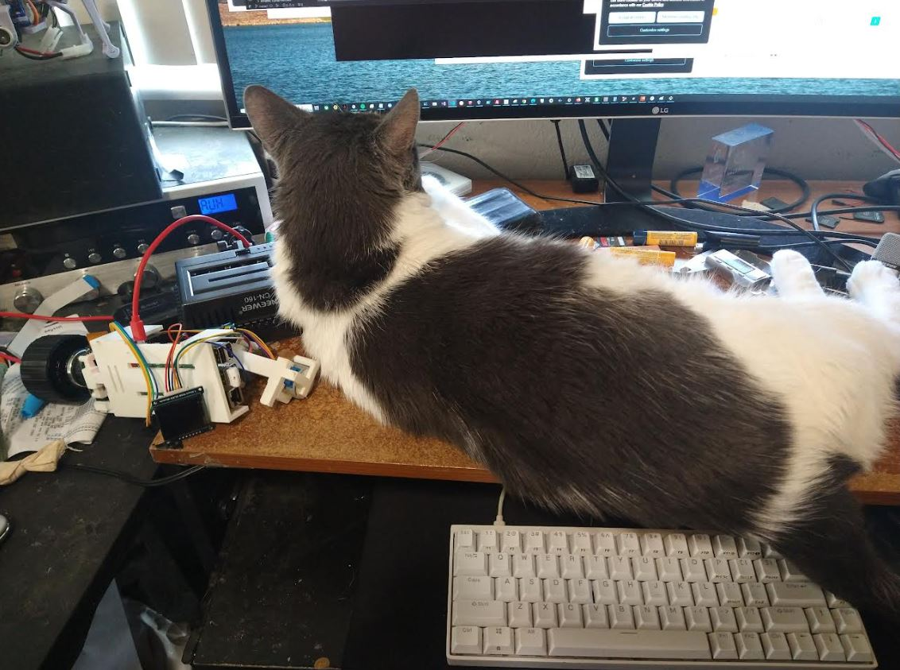
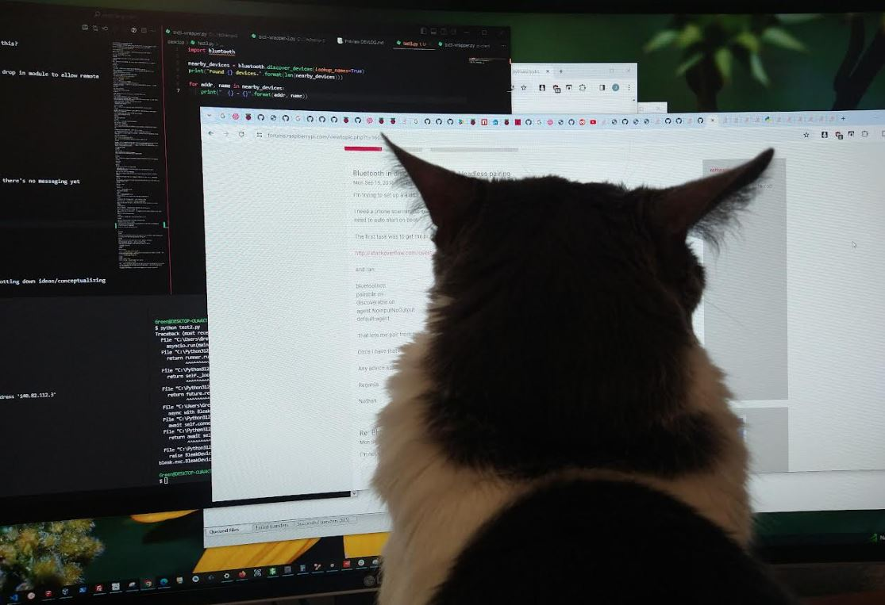
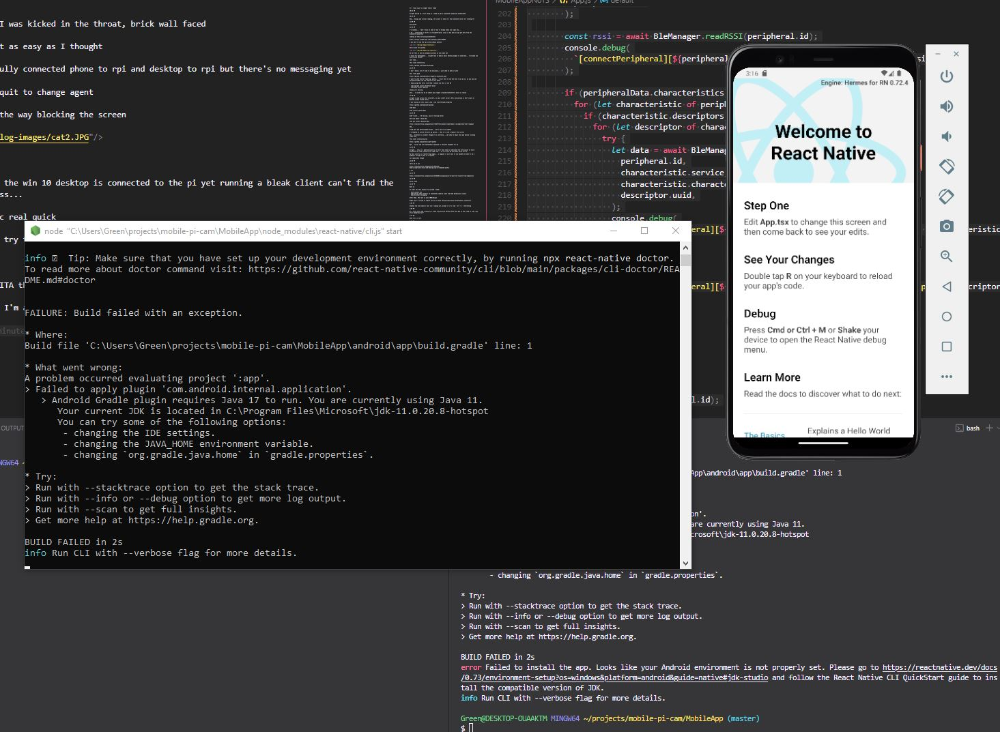
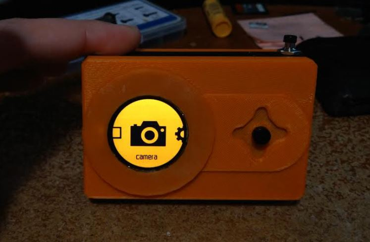

02/27/2024

10:21 AM

Starts off the day with misery business damn

I'm developing against the ML Hat Cam guts mostly for the wired so I can keep it going for a while

But also no systemd service using the camera that I gotta turn on/off on the cameras

It has a 5mm lens on it

Dang it I gotta remember the ip address... arp-scan but only on mac not near me dang it

It's crazy a gif is larger than a video

10:42 AM

Alright moving on, first thing is I need to get a bluetooth connection established

10:45 AM

Hmm... doing some initial reading, the client is okay it's the bluetooth server I'm looking for

11:09 AM

Distracted

11:15 AM

I'm swimmin... I don't have an idea of how to bridge these two right now...

I do... connecting to the Pi is straightforward, issue is how does an app get data from the bluetooth connection

looking at this and using bluetoothctl

https://forums.raspberrypi.com/viewtopic.php?t=160295

I was able to see the rpi on my windows machine

hmm it asks for passkey

So far this is not an automatic process so not great yet

I think for development... I might have to make a basic desktop widget to send data... I've made one before with tkinter

Just time...

This looks interesting

https://github.com/IanHarvey/bluepy

11:29 AM

I don't have a lot of time to do discovery, I just need to make it work

This looks good

https://github.com/EnableTech/raspberry-bluetooth-demo

I want to send entire frames eg. photos... I will have to see how fast I can do it, so you can see the passthrough from the camera on your phone

I keep using that word, live feed I should say this is not AR

- sudo apt-get install bluetooth bluez
- sudo pip3 install pybluez

nooooo it's failing

well... I could also do an stdout api wrapper (around bluetoothctl) which is rancid

11:38 AM

Alright I came across this term GATT, so want a GATT server (RPi) and android is GATT client or desktop client (bleak works)

I was looking at this, basic code I can read through/integrate

https://github.com/Douglas6/cputemp

need dbus

pip3 install python-dbus

11:45 AM

Didn't work... I'm failing, you are failing doctor

Ahh lite doesn't have dbus

sudo apt install python3-dbus

https://stackoverflow.com/questions/71867578/no-module-named-dbus-i-already-have-that-raspbian

hmm...

tried gatt and advertisement bluez... don't see it on windows

I'm tempted to switch the wifi ap option... then it's like a regular http server

Ehh... bluetooth is cleaner though of an interface... idk they're about the same button clicking steps wise

This looks interesting too

https://github.com/getsenic/gatt-python

Ugh... so far the raw bluetoothctl approach is the most tangible for me

11:59 AM

Alright... this is a dumb decision but I don't have time to understand the intricacies of which bluetooth low level thing to use right now... so I'll just go with what works for me.

My main concern is transferring images... I imagine it will have to use base64 and that'll be a gigantic string to have in a console

not impossible though

12:06 PM

let's do it lol

https://stackoverflow.com/questions/9322796/keep-a-subprocess-alive-and-keep-giving-it-commands-python

a sin

12:12 PM

https://stackoverflow.com/questions/63782892/using-asyncio-to-wait-for-results-from-subprocess

12:14 PM

quick break

12:46 PM

Back on

In order for this project to succeed I need:

- auto connect rpi
- android app that connects to bluetooth properly (last time had permission issues)
- bidirectional messaging

After that, the rest is just CRUD/design

Right now I'm trying to figure out how to have the peristent/async bluetoothctl connection

1:05 PM

Somehow the ssh window's text isn't coming out, except if it's like `ctrl + c` interesting

1:07 PM

As I write this code I think of a scene from Silicon Valley where this guy in the crowd is like "you are a dangerous man!"

1:15 PM

damn this is hard

1:22 PM

look who it is

Plops himself right down

1:50 PM

Yeah... I'm making garbage for sure

I need to test the client initiated comms right away so doing that now

1:58 PM

I did have an idea, the mjpeg_server... that is hosting a webapp

with access point... could control it that way, no mobile app

gonna try access point real quick... well issue is will lose ssh connection to it I think

2:08 PM

posted a question

This is a sad time... the point where I ask myself, why am I doing this?

Another rejection letter for a job app, sad

Ugh... so many steps to setup the AP... it's supposed to be just a drop in module to allow remote control...

Guess I'll stick with bluetooth then

2:18 PM

I don't get it, the MAC addr is there but bleak doesn't see it

2:23 PM

damn feel like I was kicked in the throat, brick wall faced

bluetooth is not as easy as I thought

I have successfully connected phone to rpi and desktop to rpi but there's no messaging yet

oh I gotta say quit to change agent

dang cat is in the way blocking the screen

2:39 PM

I don't get how the win 10 desktop is connected to the pi yet running a bleak client can't find the bluetooth address...

might try on mac real quick

wait... I could try the rn app right away and mess with bluetooth there

3:14 PM

Ugh... what a PITA this cross platform dev, so slow

Can't complain, I'm a dummy don't know Java

REEEEEEE

I'm failing failing failing ahhhhhh

3:35 PM

just sadness... I have failed... FAILED!!!

only positive is provided I get my tax return tomorrow I will be able to order a camera module v3

something to look forward to when my next 4 days of warehouse work ends

Then I'll be able to take the camera outside/try it for real since the footage should be worth it

Oh man... it's gonna be raining those days lmao

3:49 PM

Okay so android emulator doesn't do bluetooth damn

3:56 PM

Alright... had to find a usb-c cable, will run app on my phone

of course my windows 10 search bar crashed, great

4:20 PM

ugh... had to set an environment variable

kill vs code, start over... now my antivirus is blocking android great... even though it's already in the allow list

4:26 PM

ugh... running the demo can't find any bluetooth devices hmm

wait... is it because it's not ble

4:39 PM

I had to say "advertise on" huh

4:42 PM

I connected to the RPi with the nrf connect app but not the ble-manager app

5:02 PM

Sadness... smothers us

tried to package APK won't work without metro

making apk from this tutorial

https://medium.com/geekculture/react-native-generate-apk-debug-and-release-apk-4e9981a2ea51

5:10 PM

ugh... yeah even with an apk it doesn't work but nRF does damn it

5:25 PM

oh damn... nrf connect says the advertising on pi 4 is legacy not ble

5:29 PM

help me Margot, I'm close

I feel it...

5:49 PM

Fine... I will try hci0

looking at this

https://pimylifeup.com/raspberry-pi-ibeacon/

5:53 PM

damn... alright I think I will try the AP approach

This makes it easier where there is no mobile app, it's just a website

Unfortunately there are a lot of steps to config the AP part

---

02/26/2024

6:28 PM

I'm kind of too tired/mentally spent to code right now so just jotting down ideas/conceptualizing

I will work on this tomorrow/during these next two days off

6:45 PM

Right now I'm unsure if the camera aperture can be changed on the module 3

Also thinking about spot focus... which is a location thing

I don't have a menu designed in mind yet but main things I'll hit are:

- bluetooth connectivity
- pi client

6:55 PM

This is so cool

I don't like the blue anymore... I made it with this blue gradient and it makes it look bad... idk I'm thinking orange on orange could be cool

7:10 PM

Oh damn, orange is legit!

It's so crips omg... the photo doesn't do it justice

Yeah... I don't like how the camera is on the right side currently, my hand goes over it on accident

So it will be moved to the left when I get the V3 camera module... which will be sometime next week, sucks gotta wait

The gradient unfortunately is visible on this display so I'll just use a solid color
