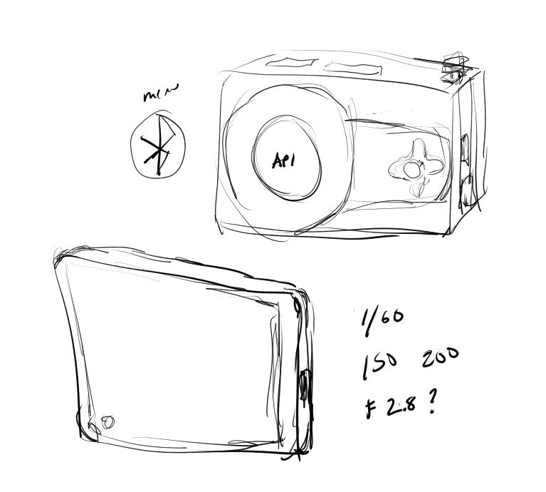

02/26/2024

6:28 PM

I'm kind of too tired/mentally spent to code right now so just jotting down ideas/conceptualizing

I will work on this tomorrow/during these next two days off

6:45 PM

Right now I'm unsure if the camera aperture can be changed on the module 3

Also thinking about spot focus... which is a location thing

I don't have a menu designed in mind yet but main things I'll hit are:

- bluetooth connectivity
- pi client

6:55 PM

This is so cool

I don't like the blue anymore... I made it with this blue gradient and it makes it look bad... idk I'm thinking orange on orange could be cool

